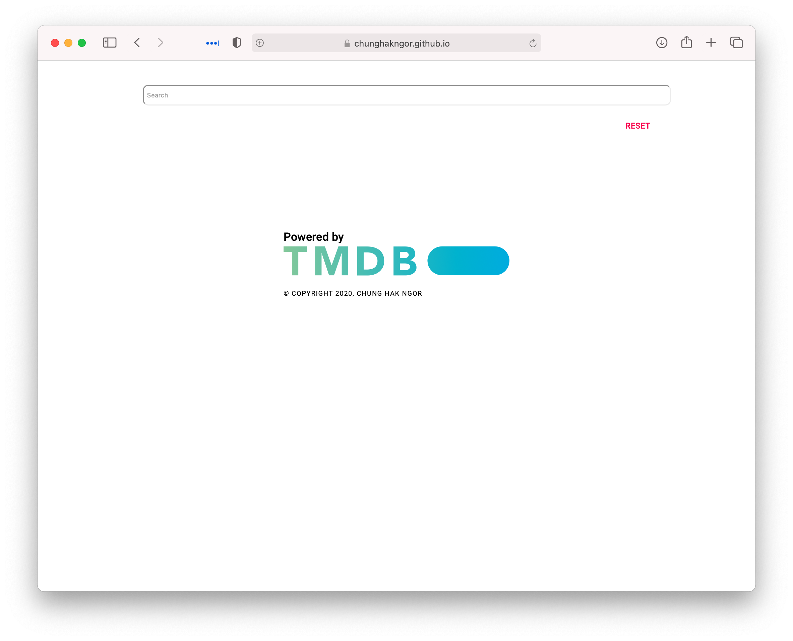
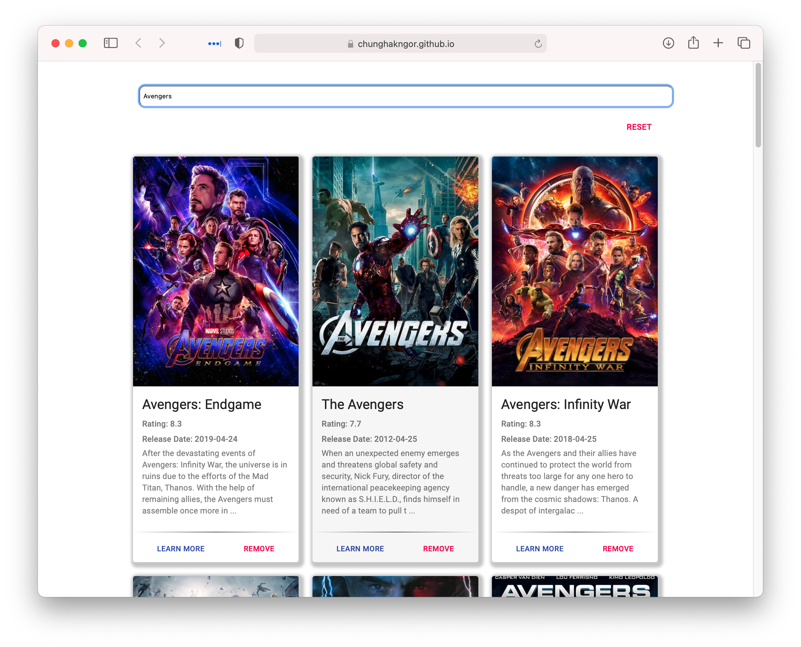

# Simple React Movie Search
<!-- Author: Chung Hak Ngor -->
## Implemented to understand React Hooks (useReducer) and Context API

<!-- Hosted on Github Pages -->
## [Live Deployment](https://chunghakngor.github.io/movie-db/)

### Requirements: 
```
- TMDb API Key
- Node.js
```

To run the application:
1. Clone the repo and run `npm install` to install all the dependencies
2. Fill the `.env` file using `template.env` 
   - Due to how Create React App takes in .ENV file, they will only be import in Production build, thus you may need to assign your own API key in the `src/App.js`
3. You can now run the website using `npm run start` 
    - Or build the website using `npm run build` and host using `serve -s build` 
    - `.env` file will work in this situation


### Some screenshot below: 




